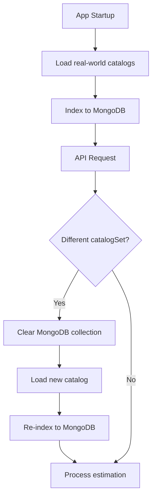
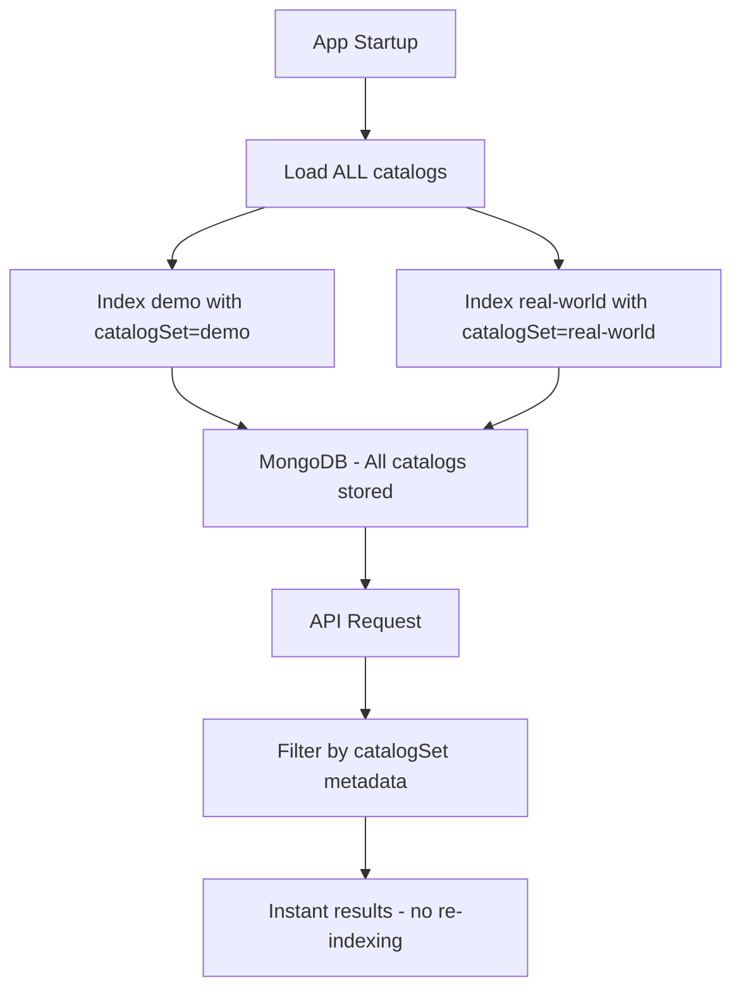

# Multi-Catalog Indexing Implementation Plan

## Overview

Currently, the system indexes only one catalog set at a time and must clear + re-index when switching between `demo` and `real-world` catalogs. This plan proposes indexing all catalogs at once with metadata filtering for instant catalog switching.

## Current Architecture



**Problems:**

- Slow catalog switching - requires full re-indexing
- Unnecessary API costs for re-embedding same documents
- Downtime during catalog switch

## Proposed Architecture



**Benefits:**

- Instant catalog switching via metadata filter
- One-time indexing cost at startup
- No API costs for re-embedding
- Support for unlimited catalog sets

---

## Implementation Details

### Step 1: Add `catalogSet` to Document Metadata

**File:** [`apps/api/src/catalogs/catalogs.service.ts`](apps/api/src/catalogs/catalogs.service.ts:162)

**Current code:**

```typescript
private async indexDocuments(
  documents: (AtomicWorkDocument | BaProcessDocument | CoefficientDocument)[],
  docType: string,
): Promise<void> {
  const metadatas = documents.map((doc) => {
    const metadata: Record<string, unknown> = {
      docType,
      id: doc.id,
      name: doc.name,
    };
    // ... existing fields
    return metadata;
  });
}
```

**New code:**

```typescript
private async indexDocuments(
  documents: (AtomicWorkDocument | BaProcessDocument | CoefficientDocument)[],
  docType: string,
  catalogSet: string,  // NEW PARAMETER
): Promise<void> {
  const metadatas = documents.map((doc) => {
    const metadata: Record<string, unknown> = {
      docType,
      catalogSet,  // NEW FIELD
      id: doc.id,
      name: doc.name,
    };
    // ... existing fields
    return metadata;
  });
}
```

### Step 2: Update Document IDs to Include Catalog Set

**Current:** `atomic_work_aw-001`
**New:** `demo_atomic_work_aw-001` or `real-world_atomic_work_aw-001`

This prevents ID collisions between catalog sets.

### Step 3: Index All Catalogs on Startup

**File:** [`apps/api/src/catalogs/catalogs.service.ts`](apps/api/src/catalogs/catalogs.service.ts:43)

**Current `onModuleInit`:**

```typescript
async onModuleInit(): Promise<void> {
  await this.loadAllCatalogs("real-world");
  await this.indexCatalogs();
}
```

**New `onModuleInit`:**

```typescript
async onModuleInit(): Promise<void> {
  // Check if already indexed
  const existingCount = await this.ragService.getDocumentCount();
  if (existingCount > 0) {
    this.logger.log(`Vector store already contains ${existingCount} documents`);
    this.isIndexed = true;
    return;
  }

  // Index ALL catalog sets
  for (const catalogSet of ['demo', 'real-world']) {
    await this.loadAndIndexCatalogSet(catalogSet);
  }
  this.isIndexed = true;
}

private async loadAndIndexCatalogSet(catalogSet: string): Promise<void> {
  this.logger.log(`Loading and indexing catalog set: ${catalogSet}`);

  await Promise.all([
    this.atomicWorksLoader.load(catalogSet),
    this.baProcessesLoader.load(catalogSet),
    this.coefficientsLoader.load(catalogSet),
  ]);

  // Index with catalogSet metadata
  const atomicWorkDocs = this.atomicWorksLoader.toDocuments();
  await this.indexDocuments(atomicWorkDocs, "atomic_work", catalogSet);

  const baProcessDocs = this.baProcessesLoader.toDocuments();
  await this.indexDocuments(baProcessDocs, "ba_process", catalogSet);

  const coefficientDocs = this.coefficientsLoader.toDocuments();
  await this.indexDocuments(coefficientDocs, "coefficient", catalogSet);

  this.logger.log(`Indexed catalog set: ${catalogSet}`);
}
```

### Step 4: Update RAG Search to Filter by Catalog Set

**File:** [`apps/api/src/catalogs/catalogs.service.ts`](apps/api/src/catalogs/catalogs.service.ts:292)

**Current `searchCatalogs`:**

```typescript
async searchCatalogs(
  query: string,
  docType?: "atomic_work" | "ba_process" | "coefficient",
  k: number = 5,
) {
  const filter = docType ? { docType } : undefined;
  return this.ragService.similaritySearch(query, { k, filter });
}
```

**New `searchCatalogs`:**

```typescript
async searchCatalogs(
  query: string,
  docType?: "atomic_work" | "ba_process" | "coefficient",
  k: number = 5,
  catalogSet?: string,  // NEW PARAMETER
) {
  const filter: Record<string, unknown> = {};

  if (docType) {
    filter.docType = docType;
  }

  // Filter by current catalog set if not specified
  filter.catalogSet = catalogSet || this.currentCatalogSet;

  return this.ragService.similaritySearch(query, { k, filter });
}
```

### Step 5: Simplify `switchCatalogSet`

**File:** [`apps/api/src/catalogs/catalogs.service.ts`](apps/api/src/catalogs/catalogs.service.ts:71)

**Current:**

```typescript
async switchCatalogSet(catalogSet: string): Promise<void> {
  await this.ragService.clearCollection();  // SLOW!
  this.isIndexed = false;
  await this.loadAllCatalogs(catalogSet);
  await this.indexCatalogs();  // EXPENSIVE!
  this.currentCatalogSet = catalogSet;
}
```

**New:**

```typescript
async switchCatalogSet(catalogSet: string): Promise<void> {
  if (catalogSet === this.currentCatalogSet) {
    return;
  }

  // Just update the current catalog set - no re-indexing needed!
  this.currentCatalogSet = catalogSet;

  // Load the catalog data for direct access (non-RAG methods)
  await this.loadAllCatalogs(catalogSet);

  this.logger.log(`Switched to catalog set: ${catalogSet}`);
}
```

### Step 6: Update Loaders to Track Catalog Set

**File:** [`apps/api/src/catalogs/loaders/atomic-works.loader.ts`](apps/api/src/catalogs/loaders/atomic-works.loader.ts)

Add a property to track which catalog set is currently loaded:

```typescript
@Injectable()
export class AtomicWorksLoader {
  private atomicWorks: AtomicWork[] = [];
  private currentCatalogSet: string = "real-world"; // NEW

  async load(catalogSet: string = "real-world"): Promise<AtomicWork[]> {
    // ... existing load logic
    this.currentCatalogSet = catalogSet; // Track loaded set
    return this.atomicWorks;
  }

  getCurrentCatalogSet(): string {
    return this.currentCatalogSet;
  }
}
```

---

## Files to Modify

| File                                                                                        | Changes                                                              |
| ------------------------------------------------------------------------------------------- | -------------------------------------------------------------------- |
| [`catalogs.service.ts`](apps/api/src/catalogs/catalogs.service.ts)                          | Add `catalogSet` to metadata, update indexing logic, simplify switch |
| [`atomic-works.loader.ts`](apps/api/src/catalogs/loaders/atomic-works.loader.ts)            | Track current catalog set                                            |
| [`ba-processes.loader.ts`](apps/api/src/catalogs/loaders/ba-processes.loader.ts)            | Track current catalog set                                            |
| [`coefficients.loader.ts`](apps/api/src/catalogs/loaders/coefficients.loader.ts)            | Track current catalog set                                            |
| [`catalog-retriever.tool.ts`](apps/api/src/tools/implementations/catalog-retriever.tool.ts) | Pass catalogSet to search methods                                    |

---

## Trade-offs

### Advantages

- **Instant catalog switching** - no re-indexing delay
- **Lower API costs** - embeddings computed once
- **Better UX** - no waiting for catalog changes
- **Scalable** - easy to add more catalog sets

### Disadvantages

- **Larger storage** - MongoDB stores all catalogs (~2x current size)
- **Longer initial startup** - first-time indexing takes longer
- **Memory usage** - loaders only hold one catalog in memory for direct access

### Mitigation

- Storage impact is minimal - catalog documents are small text entries
- Startup impact is one-time - MongoDB persists between restarts
- Memory impact is acceptable - RAG searches use filtered queries

---

## Testing Plan

1. **Unit Tests**
   - Verify `catalogSet` appears in metadata
   - Test filtering by `catalogSet` in search
   - Test ID generation includes catalog set prefix

2. **Integration Tests**
   - Start fresh - verify both catalogs indexed
   - Switch catalog set - verify instant switch
   - Search with different catalog sets - verify correct results

3. **E2E Tests**
   - API call with `catalogSet: demo` - verify demo results
   - API call with `catalogSet: real-world` - verify real-world results
   - Consecutive calls with different catalog sets - verify no re-indexing

---

## Migration Path

For existing deployments with already-indexed data:

1. **Option A: Clear and Re-index**

   ```bash
   # CLI command to force full re-index
   npm run cli catalog reindex --all
   ```

2. **Option B: Background Migration**
   - Index new catalogs in background
   - Switch once indexing complete
   - Clean up old documents

---

## Summary

This change transforms catalog switching from an expensive re-indexing operation into a simple metadata filter lookup. The implementation is straightforward and requires minimal code changes while providing significant UX improvements.
